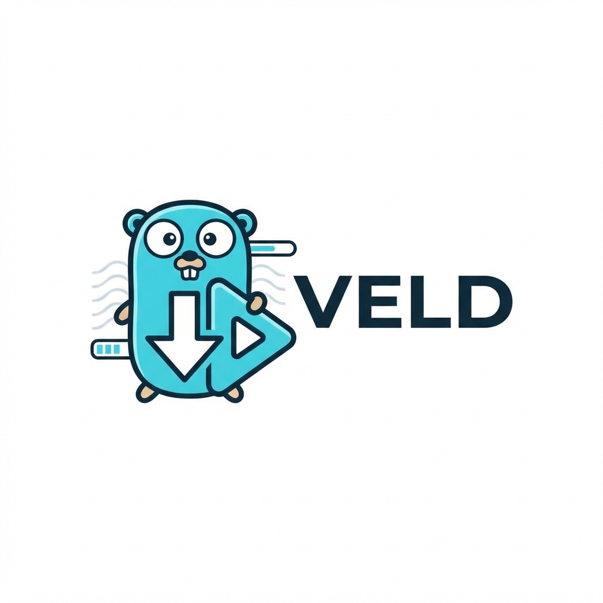

<p align="center">
  
</p>

<h1 align="center">Veld - HLS & DASH Video Downloader</h1>

<p align="center">
  <strong>The fastest open-source streaming video downloader for HLS and DASH</strong>
</p>

<p align="center">
  <a href="https://github.com/mohaanymo/veld/releases"></a>
  <a href="https://go.dev"></a>
  <a href="LICENSE"></a>
  <a href="https://github.com/mohaanymo/veld/stargazers"></a>
</p>

<p align="center">
  <a href="#-installation">Installation</a> •
  <a href="#-quick-start">Quick Start</a> •
  <a href="#-features">Features</a> •
  <a href="#-track-selection">Track Selection</a> •
  <a href="#-library-usage">Library Usage</a>
</p>

---

## What is Veld?

**Veld** is a high-performance command-line tool and Go library for downloading HLS (m3u8) and DASH (mpd) video streams. Whether you're archiving live streams, downloading VOD content, or building video applications, Veld makes it fast and easy.

### Why Choose Veld?

| Feature | Veld | yt-dlp | N_m3u8DL-RE |
|---------|:----:|:------:|:-----------:|
| Concurrent downloads | ✅ 128 threads | ❌ | ✅ |
| Resume interrupted downloads | ✅ | ❌ | ✅ |
| Interactive track picker | ✅ | ❌ | ❌ |
| Rate limiting | ✅ | ✅ | ❌ |
| Go library API | ✅ | ❌ | ❌ |
| Memory efficient (disk-based) | ✅ | ✅ | ❌ |
| HLS AES-128 decryption | ✅ | ✅ | ✅ |
| DASH CENC decryption | ✅ | ❌ | ✅ |

---

## 🚀 Installation

### Download Binary

Grab the latest release for your platform:

```bash
# Linux
curl -L https://github.com/mohaanymo/veld/releases/latest/download/veld-linux-amd64 -o veld
chmod +x veld
sudo mv veld /usr/local/bin/

# macOS
brew install mohaanymo/tap/veld

# Windows
# Download veld.exe from Releases page
```

### Install with Go

```bash
go install github.com/mohaanymo/veld/cmd/veld@latest
```

### Build from Source

```bash
git clone https://github.com/mohaanymo/veld.git
cd veld
go build -o veld ./cmd/veld
```

---

## ⚡ Quick Start

### Download a Video (Interactive)

```bash
veld -u "https://example.com/video.m3u8"
```

This opens an interactive picker to choose video quality, audio tracks, and subtitles.

### Download Best Quality Automatically

```bash
veld -u "https://example.com/video.m3u8" -s best -fn movie.mp4
```

### Download with Limited Bandwidth

```bash
veld -u "https://example.com/video.m3u8" -s best --max-bandwidth 2M
```

---

## ✨ Features

### 🎯 Smart Track Selection

Veld has the most powerful track selector of any streaming downloader:

```bash
# Resolution ranges
veld -u URL -s "720p-1080p"           # Between 720p and 1080p
veld -u URL -s "-720p"                # Best up to 720p

# Multiple audio languages
veld -u URL -s "v:best + a:en,es,fr"  # Video + 3 audio tracks

# Bandwidth filtering
veld -u URL -s "a:[128k-256k]"        # Audio 128-256 kbps

# Modifiers
veld -u URL -s "s:en!"                # English subs (required, fail if missing)
veld -u URL -s "a:?*"                 # All audio including undefined language
```

### 💾 Resume Downloads

Downloads automatically resume if interrupted:

```bash
veld -u "https://example.com/video.m3u8" -s best
# Downloads 60%... connection drops

veld -u "https://example.com/video.m3u8" -s best
# ✓ Resuming: skipped 180/300 segments
```

### 🔐 Encrypted Streams

```bash
# HLS with AES-128 (key auto-fetched from manifest)
veld -u "https://example.com/encrypted.m3u8" -s best

# DASH with CENC (provide key manually)
veld -u "https://example.com/drm.mpd" -s best --key "KID:KEY"
```

### 🎨 Beautiful Terminal UI

<p align="center">
  
</p>

---

## 📖 Track Selection

### Basic Selectors

| Selector | Description |
|----------|-------------|
| `best` | Best video + best audio |
| `all` | All tracks |
| `1080p` `720p` `480p` | By resolution |
| `4k` `hd` `sd` | Quality presets |

### Advanced Selectors

| Selector | Description |
|----------|-------------|
| `v:best + a:en + s:en` | Video + English audio + English subs |
| `v:-1080p` | Best video up to 1080p |
| `a:en,es,fr*` | All English, Spanish, French audio |
| `v:0 + a:1` | By index (first video, second audio) |
| `a:[>128k]` | Audio above 128kbps |

### Modifiers

| Modifier | Meaning |
|----------|---------|
| `!` | Required (fail if not found) |
| `?` | Include undefined/unknown language |
| `*` | Select all matching tracks |

---

## 📚 Library Usage

Use Veld as a Go library in your applications:

```go
package main

import (
    "context"
    "log"
    
    "github.com/mohaanymo/veld"
)

func main() {
    d, err := veld.New(
        veld.WithURL("https://example.com/video.m3u8"),
        veld.WithFileName("output.mp4"),
        veld.WithTrackSelector("best"),
        veld.WithMaxBandwidth(5*1024*1024), // 5 MB/s limit
    )
    if err != nil {
        log.Fatal(err)
    }
    defer d.Close()

    ctx := context.Background()
    
    // Parse manifest
    if err := d.Parse(ctx); err != nil {
        log.Fatal(err)
    }
    
    // Select tracks
    if err := d.SelectTracks(); err != nil {
        log.Fatal(err)
    }
    
    // Download
    if err := d.Download(ctx); err != nil {
        log.Fatal(err)
    }
}
```

### Available Options

```go
veld.WithURL(url string)                    // Stream URL (required)
veld.WithFileName(name string)              // Output filename
veld.WithOutputDir(dir string)              // Output directory
veld.WithFormat(fmt string)                 // mp4, mkv, ts
veld.WithThreads(n int)                     // Concurrent downloads (1-128)
veld.WithTrackSelector(sel string)          // Track selection expression
veld.WithHeaders(h map[string]string)       // Custom HTTP headers
veld.WithDecryptionKeys(keys []string)      // KID:KEY pairs
veld.WithMaxBandwidth(bps int64)            // Rate limit in bytes/sec
veld.WithVerbose(v bool)                    // Enable verbose logging
```

---

## ⚙️ CLI Reference

```
veld - High-performance HLS/DASH video downloader

Usage: veld [options] -u <URL>

Options:
  -u, --url <URL>           Stream URL (m3u8 or mpd) [required]
  -fn, --filename <name>    Output filename
  -n, --threads <num>       Concurrent downloads (default: 16, max: 128)
  -s, --select-track <sel>  Track selection (omit for interactive picker)
  -P, --parallel-tracks     Download all tracks in parallel
  -f, --format <fmt>        Output format: mp4, mkv, ts (default: mp4)
  -H, --header <header>     Custom HTTP header (can repeat)
      --cookie <cookies>    Cookies for authenticated requests
      --key <KID:KEY>       Decryption key(s), comma-separated
      --muxer <backend>     Muxer: auto, ffmpeg, binary (default: auto)
      --no-progress         Disable TUI, output to stdout
  -v, --verbose             Verbose output
      --version             Show version
```

---

## 🔧 Requirements

- **FFmpeg** (optional but recommended) - Required for muxing to MP4/MKV with multiple tracks

---

## 📈 Performance

Veld is optimized for maximum throughput:

- ✅ HTTP/2 multiplexing
- ✅ Connection pooling (100+ connections per host)
- ✅ Disk-based segment storage (low memory usage)
- ✅ Concurrent track downloads

Typical speeds on a 100 Mbps connection:

| File Size | Time |
|-----------|------|
| 500 MB | ~40s |
| 1 GB | ~80s |
| 5 GB | ~7 min |

---

## 🤝 Contributing

Contributions are welcome! Here's how:

1. Fork the repository
2. Create a feature branch (`git checkout -b feature/amazing`)
3. Commit your changes (`git commit -m 'Add amazing feature'`)
4. Push to the branch (`git push origin feature/amazing`)
5. Open a Pull Request

---

## 📄 License

MIT License - see [LICENSE](LICENSE) for details.

---

<p align="center">
  <b>Veld</b> - Fast. Resumable. Beautiful.<br>
  <sub>Made with ❤️ in Go</sub>
</p>

---

## 🏷️ Keywords

`hls-downloader` `dash-downloader` `m3u8-downloader` `mpd-downloader` `video-downloader` `streaming-downloader` `go` `golang` `cli` `terminal` `ffmpeg` `media-downloader` `vod-downloader` `live-stream-downloader` `concurrent-downloader` `resumable-downloads`
